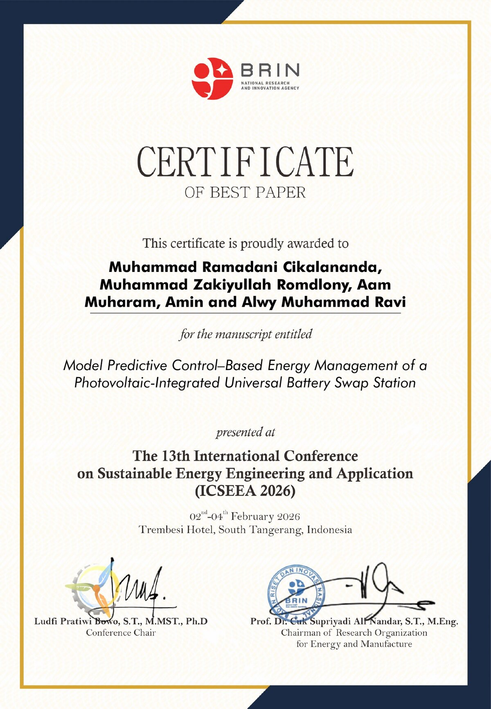

# MPC-Based Energy Management for Universal Battery Swap Stations with PV Cogeneration

🏆 **Best Paper Award**, 13th International Conference on Sustainable Energy
Engineering and Application (ICSEEA 2026), organized by BRIN (Indonesia's
National Research and Innovation Agency) — Feb 2–4, 2026, South Tangerang,
Indonesia.




This repository contains the MATLAB simulation framework from my Master's
thesis at Telkom University, which asks: **can a battery swap station use
predictive control to charge a fleet of *different* battery brands off solar
power, without making customers wait?**

## Why this problem matters

Indonesia is pushing hard on electric motorcycle adoption, and battery swap
stations (swap your depleted battery for a charged one in seconds) are the
government's preferred infrastructure model over plug-in charging. But the
market has no battery standard — different brands run different voltages and
capacities — so most existing swap-station designs assume one battery type
and one fixed charging profile. That assumption breaks down the moment a
station has to serve everyone.

This project builds a station model that handles that heterogeneity directly:
a Model Predictive Control (MPC) controller sets the charging current for
*each* slot individually, every minute, based on forecasted solar generation,
electricity price, and each battery's swap deadline — instead of charging
every slot the same way and hoping the grid and solar supply keep up.

## Results

Simulated over a 30-day operating horizon, comparing the MPC controller
against a non-predictive baseline, an adaptive multi-stage CC-CV charger, and
a linear-programming controller:

| Metric | Baseline (no MPC) | With MPC |
|---|---|---|
| Average customer waiting time | ~35–40 min | **< 5 min** (>85% reduction) |
| Batteries served with zero wait (per day) | ~420 | **> 540** |
| System Economic Burden* | ~14–19 million IDR | **1.5–4.3 million IDR** (>10x improvement) |
| Grid energy cost | baseline | within ±2% of baseline |

*System Economic Burden (SEB) is a metric I defined for this thesis that
converts grid cost, customer waiting time (via a value-of-time calculation),
and wasted solar energy into one comparable IDR figure — so "cheaper on
paper" strategies that make customers wait a long time don't look falsely
good.

The controller also held up when tested against scenarios it wasn't designed
for: coarser (hourly instead of per-minute) forecast data, and sudden demand
spikes/clustering it hadn't seen in training — service quality stayed close
to the tuned baseline in both cases.

## Publication

This work was published and awarded Best Paper at ICSEEA 2026:

> M. R. Cikalananda, M. Z. Romdlony, A. Muharam, Amin, and A. M. Ravi,
> "Model Predictive Control–Based Energy Management of a Photovoltaic-Integrated
> Universal Battery Swap Station," presented at the 13th International
> Conference on Sustainable Energy Engineering and Application (ICSEEA 2026),
> South Tangerang, Indonesia, Feb 2–4, 2026.

Full thesis: *Model Predictive Control Based Energy Management for Universal
Battery Swap Stations with Photovoltaic Cogeneration*, Master's Thesis,
School of Electrical Engineering, Telkom University.

## How it works

At every control step, the MPC controller:

1. Forecasts PV generation and grid price over a short prediction horizon
2. Solves a constrained optimization (`fmincon`) for the charging current of
   every occupied slot, minimizing a weighted sum of grid cost, missed-deadline
   penalty, and wasted-solar (spillage) penalty
3. Applies only the first step of the resulting plan, then re-solves at the
   next step (receding horizon) as new information comes in

The thesis also sweeps different weight combinations to find the best
cost/service trade-off, tests four "forecast resolution" scenarios (how
coarsely PV and battery-arrival data is fed to the controller), and
stress-tests the best configuration against extreme arrival scenarios
(sudden clustering, rare-hour surges).

## Project structure

```
main.m                  Entry point: runs and compares all simulations
config/
  prep_sim_config.m      Simulation parameters (station, PV, BSS, pricing, ...)
data_generation/
  generate_pv_profile.m           Builds the PV generation forecast
  generate_realistic_battery_queue.m  Simulates realistic battery arrivals
  irradiance_curve.m               Synthetic solar irradiance curve
  apply_extreme_arrival_case.m     Injects stress-test arrival scenarios
optimization/
  solve_mpc_horizon.m       Low-level fmincon solve for one MPC step
  compute_total_cost.m      MPC objective function
  grid_limit_constraint.m   Nonlinear grid-import constraint
  prepare_resolution_inputs.m  Builds PV forecast/deadlines per resolution mode
simulations/
  run_mpc_simulation.m      Full station simulation using MPC charging
  run_normal_simulation.m   Baseline (non-optimized) simulation
  run_amcccv_simulation.m   Adaptive multi-stage CC-CV baseline
  run_lp_simulation.m       Linear-programming baseline
comparison/
  compare_all_mpc_runs.m       Metrics tables, plots, Excel/`.mat` export
  compare_all_mpc_runs_SEB.m   Cost breakdown using the SEB metric
outputs/                  Generated plots, data, and logs (git-ignored)
```

## Running it

Requires MATLAB with the Optimization Toolbox (`fmincon`) and Parallel
Computing Toolbox (`parfor`, used for the weight sweep — falls back to a
regular loop if unavailable, just slower).

```matlab
main
```

This runs the full comparison suite and writes plots, an Excel workbook, and
log files to `outputs/`.

## Notes on this cleanup

This is my thesis code, tidied up for a portfolio. I removed MATLAB autosave
files, a couple of superseded/duplicate scripts, and one unimplemented,
always-zero metric ("slot usage") that was never wired up. Some file and
function names were also standardized (e.g. dropping `_v2` suffixes) with all
call sites updated accordingly. No simulation logic, numerical parameters, or
algorithm behavior were changed.

## License

The code in this repository is MIT licensed — see [LICENSE](LICENSE). This
covers the MATLAB source only. The thesis text, the conference paper, and the
award certificate remain under their respective copyrights (Telkom University
and the ICSEEA 2026 / BRIN conference proceedings) and are included here for
portfolio/reference purposes, not for reuse.

## Author

**Muhammad Ramadani Cikalananda**
M.Eng, School of Electrical Engineering, Telkom University
